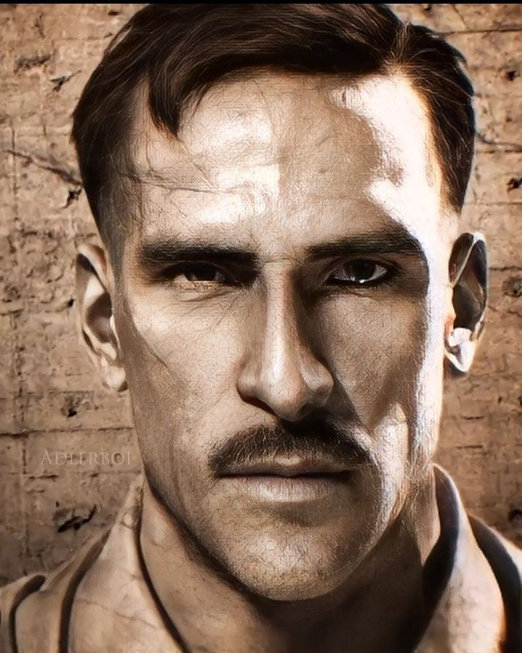

+++
title = "Edward Richtofen"
date = 2024-11-26T09:54:55+01:00
description = "La historia y locura del Doctor Edward Richtofen, uno de los personajes más icónicos de Call of Duty Zombies."
draft = false
+++

# Edward Richtofen

El *Doctor Edward Richtofen* es un personaje central en el modo Zombies de la saga *Call of Duty*, específicamente en los títulos desarrollados por **Treyarch**. Este científico alemán excéntrico y a menudo cruel es conocido por su papel como antagonista y, en ocasiones, antihéroe en las historias interdimensionales y apocalípticas del modo Zombies.

---

## Orígenes y Primeras Apariciones

Richtofen hizo su debut en *Call of Duty: World at War* (2008) como uno de los cuatro personajes jugables en el mapa **"Shi No Numa"**. Desde entonces, su personalidad, mezcla de locura y genialidad, lo ha convertido en un favorito de los fans.

### Trasfondo
Richtofen es un científico nazi que trabajaba en **Group 935**, una organización secreta que experimentaba con el Elemento 115 para desarrollar armas y tecnología avanzadas. Estos experimentos dieron lugar a la creación de los zombis, así como a dispositivos de teletransportación y manipulación temporal.

---

## Personalidad y Características

- **Excéntrico y Despiadado**: Aunque es brillante, Richtofen muestra un desprecio total por la vida humana, lo que se refleja en su disposición a realizar experimentos horribles en sujetos vivos.
- **Humor Oscuro**: Sus comentarios durante el juego a menudo mezclan humor macabro y locura, lo que añade un toque único al personaje.
- **Ambición Desmedida**: Su deseo de poder lo lleva a traicionar a sus aliados y a intentar dominar dimensiones enteras.
- **Lado Humano**: A pesar de su crueldad, algunos momentos muestran indicios de arrepentimiento y un deseo de redimirse en ciertas líneas temporales.

---

## Historia en el Universo Zombies

### La Cronología Original
En los eventos de *World at War* y *Black Ops*, Richtofen conspira para tomar el control de los zombis, enfrentándose al Doctor Maxis y a Samantha, su hija. A través de una serie de mapas icónicos como **"Der Riese"** y **"Moon"**, Richtofen logra intercambiar almas con Samantha y toma control del Éter, lo que le da dominio sobre los no-muertos.

### La Cronología de Primis
En *Black Ops III* y *Black Ops IV*, se introduce una versión alternativa de Richtofen conocida como **Primis Richtofen**. Esta versión es menos caótica y está motivada por el deseo de romper el ciclo interminable de destrucción. Él y su equipo viajan a través de dimensiones para corregir los errores de la realidad.

---

## Mapas Destacados

1. **Der Riese (World at War)**: Donde comienzan los planes de Richtofen y se revelan sus traiciones.
2. **Moon (Black Ops)**: Richtofen completa su plan maestro para controlar a los zombis al cambiar de alma con Samantha.
3. **Origins (Black Ops II)**: Presenta la versión Primis de Richtofen y el inicio de su redención.
4. **Revelations (Black Ops III)**: Culmina la historia, con Richtofen y su equipo enfrentándose a un mal supremo para restaurar el equilibrio en el multiverso.

---

## Frases Icónicas

- "La locura es la única respuesta sensata."
- "¡Mein Gott! Este lugar está lleno de cosas que matan."
- "¿Escuchas las voces? Yo las escucho todo el tiempo..."

---

## Impacto Cultural

Edward Richtofen se ha convertido en uno de los personajes más queridos y complejos de la saga *Call of Duty*. Su evolución a lo largo de los juegos, desde un lunático despiadado hasta un hombre en busca de redención, ha cautivado a los jugadores y asegurado su lugar como un ícono del universo de los videojuegos.

---

## Curiosidades

- Richtofen es interpretado por **Nolan North**, quien también ha dado voz a personajes icónicos como Nathan Drake de *Uncharted*.
- Su obsesión con el Elemento 115 y la teletransportación está inspirada en teorías conspirativas reales sobre experimentos durante la Segunda Guerra Mundial.
- En la línea temporal original, su alma es atrapada en el Éter Oscuro, convirtiéndolo en una parte esencial del ciclo sin fin de los zombis.

---

<a href="https://www.callofduty.com/blackops" target="_blank" rel="noopener">Explora más sobre Call of Duty: Zombies</a>
